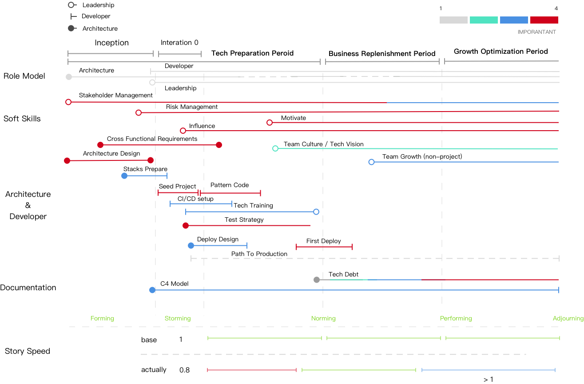

# Tech Lead Toolbox

**The origin Tech Lead articles is need to delete. And now I working on build the tools, welcome to join us.**

> A toolbox for better tech lead of Phodal

Todos:

**Soft Skills**

 - Team Development Model
 - Scenario Leadership Model

**Team**

 - Flow
 - Sweet Spot
 - Culture Checklists

**Dev Skills**

 - Dev Skills Checklists

**Leadership**

 - Thomas-Kilmann Conflict Theory 
 - CHAMPFROGS Model
 - Cone of uncertainty
 - Stakeholder Mapping
 - Six principles of influence
 - Join New Team

## Tech Toolbox

### [ADR](https://github.com/phodal/adr) - Architecture Decision Records in Node.js with Reporter, supported Windows, GNU/Linux, macOS.

### [TLA](https://github.com/phodal/tla) - Tech Lead Assessments Radar

### [Path](https://github.com/phodal/path) - Path To Production

### [TechStack](https://github.com/phodal/techstack) - A Radar for Projects' Toolbox

License
---

© 2019 A [Phodal Huang](https://www.phodal.com)'s [Idea](http://github.com/phodal/ideas).  This code is distributed under the MIT license. See `LICENSE` in this directory.
