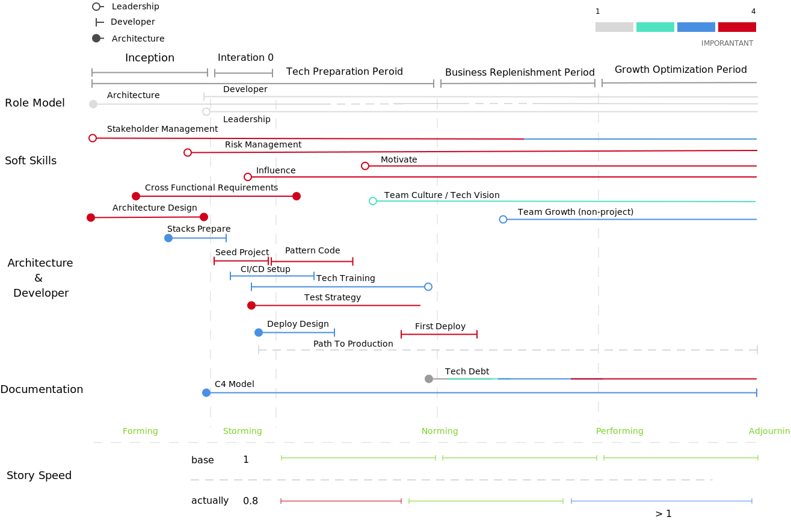
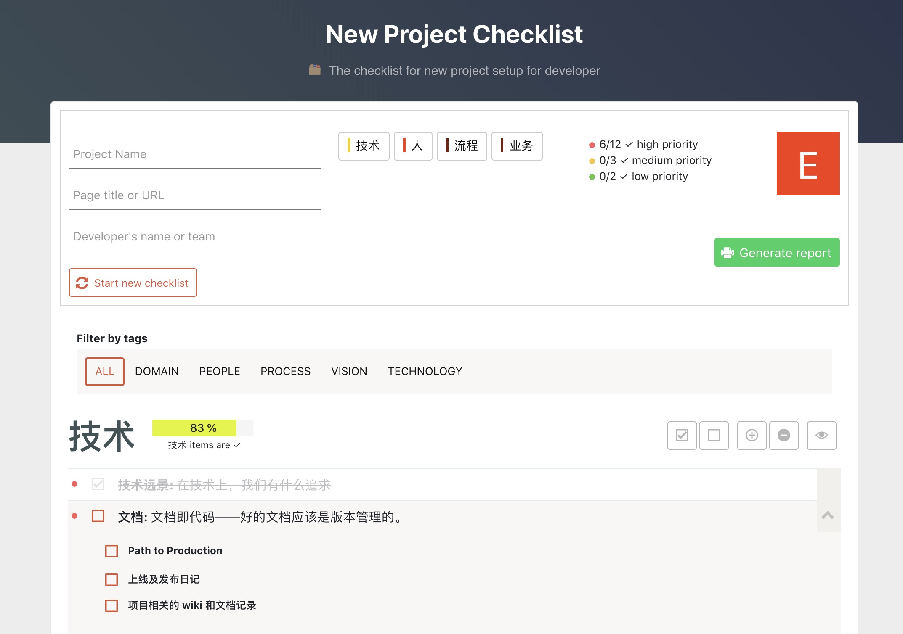
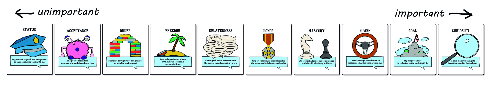
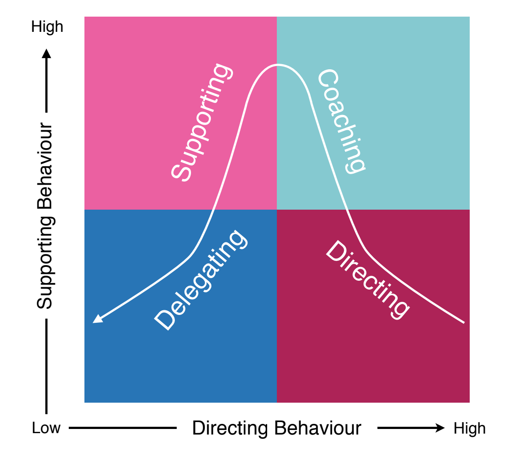
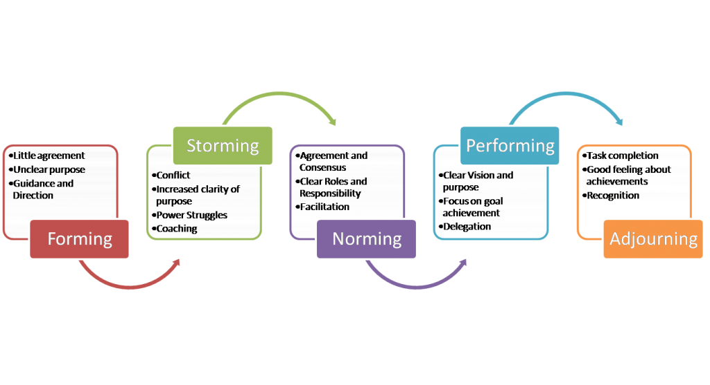
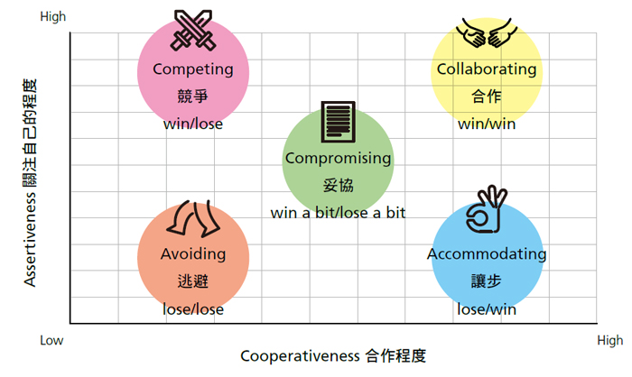
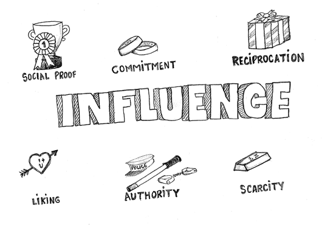
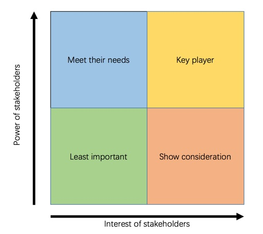
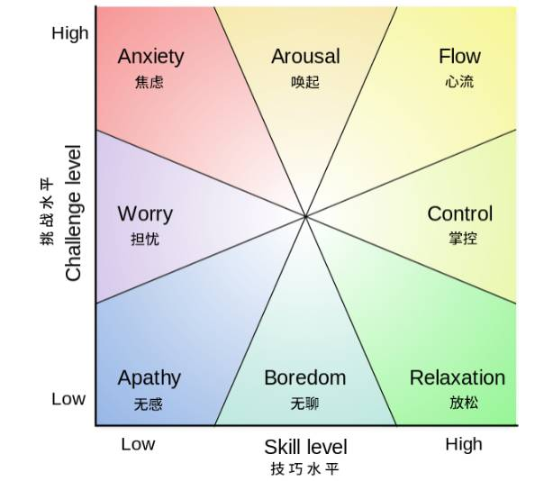

# Tech Lead Toolbox

**The origin Tech Lead articles is need to delete. And now I working on build the tools for Tech Lead, welcome to join us.**

> A toolbox for better tech lead of Phodal

Todos:

**Soft Skills**

 - Team Development Model
 - Scenario Leadership Model

**Team**

 - Flow
 - Sweet Spot
 - Culture Checklists

**Dev Skills**

 - Dev Skills Checklists

**Leadership**

 - Thomas-Kilmann Conflict Theory 
 - CHAMPFROGS Model
 - Cone of uncertainty
 - Stakeholder Mapping
 - Six principles of influence
 - Join New Team

## DEFINE

### WHAT IS TECH LEAD? 

Tech Lead can be a purely technical job, while others act as project managers. If you only look at the role of Lead with Tech, then it is:

 * **Architect**, **Technologist**. Compared with the project manager and the technical manager, he/she not only focuses on the technical practice and progress of the project, but also has to solve the most complicated technical problems.
 * **Technical role model**. Tech Lead is more like a spiritual “leader” who needs to let other people in the project see the way forward.
 * **Developer**. He/she takes time to write code in the project, which, as defined in the training, takes at least 30% of the time to write. First, master a series of technologies related to the project; second, continue to improve technical capabilities, rather than become managers.

In addition to technical work, he/she also needs to understand the business in order to develop software that meets business needs. There is also a need to manage risk (mainly technology-related risks) in order to respond to changes.

### 什么是 Tech Lead？

Tech Lead 可以是一个纯粹的技术岗位，有的则还要充当项目经理的职责。如果只以 Tech 来看待 Lead 这个角色，那么它是：

 * **架构师**、**技术专家**。与项目经理，技术管理者相比，他/她不仅仅关注于项目的技术实践和进度，还得去解决那些最复杂的技术问题。
 * **技术榜样**。Tech Lead 更像是一个精神 “领袖”，他/她需要让项目中的其他/她人看到前进的方向。
 * **开发人员**。他/她在项目中抽取时间来编写代码，如 在培训上所定义的那样，至少需要 30% 的时间来编写。一来，掌握项目相关的一系列技术；二来，不断提升技术能力，而不是成为管理者。

除了技术上的工作，他/她还需要懂业务，以此才能开发出符合业务需求的软件。还需要能管理风险（主要是技术相关的风险），才能对应变化。

## Tech Toolbox

### [ADR](https://github.com/phodal/adr) - Architecture Decision Records in Node.js with Reporter, supported Windows, GNU/Linux, macOS.

### [TLA](https://github.com/phodal/tla) - Tech Lead Assessments Radar

### [Path](https://github.com/phodal/path) - Path To Production

### [TechStack](https://github.com/phodal/techstack) - A Radar for Projects' Toolbox

### [New Project Checklist](https://github.com/phodal/new-project-checklist) - https://github.com/phodal/new-project-checklist

Checklist: TBD

## Leadership Theory

### Motivation: CHAMPFROGS Model

### Risk Management: Cone of Uncertainty

### Scenario Leadership Model

### Team Development Model

### Conflict Management: Thomas-Kilmann Conflict Theory 

### Six principles of influence

### Stakeholder Mapping

### Flow

## Related

English: 

 - [Awesome Leadership and Management](https://github.com/LappleApple/awesome-leading-and-managing)
 - [Tech Leading](https://github.com/PeterCookDev/TechLeading)
 - [Reading Lists](https://github.com/techleadworkshops/coaching/blob/master/reading-list.md)
 - [Tech Leadership](https://github.com/icaroseara/tech-leadership)

中文（Chinese）见：[Tech Lead 相关文章](articles/README.md)

License
---

© 2019 A [Phodal Huang](https://www.phodal.com)'s [Idea](http://github.com/phodal/ideas).  This code is distributed under the MIT license. See `LICENSE` in this directory.
