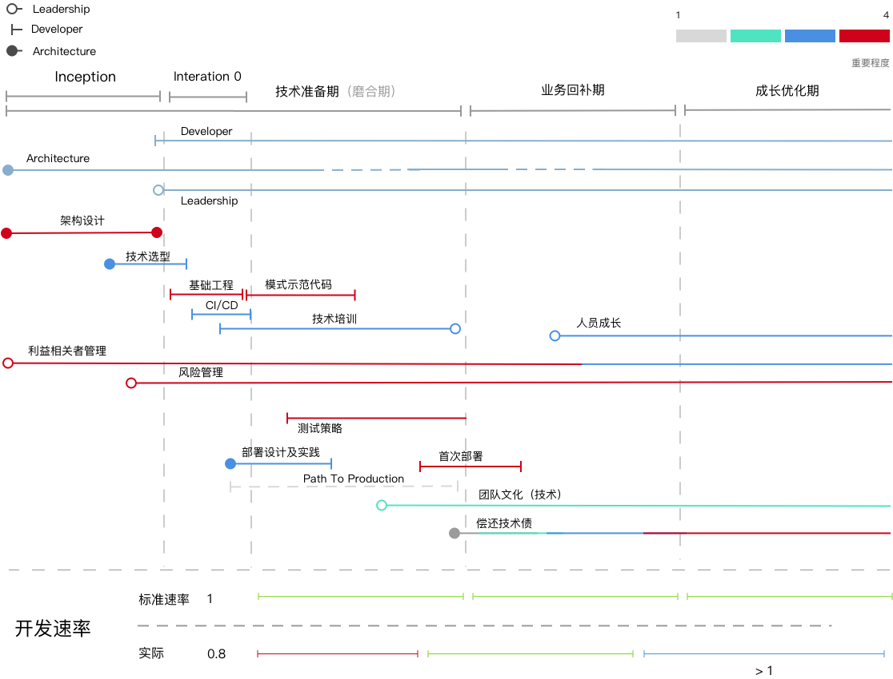
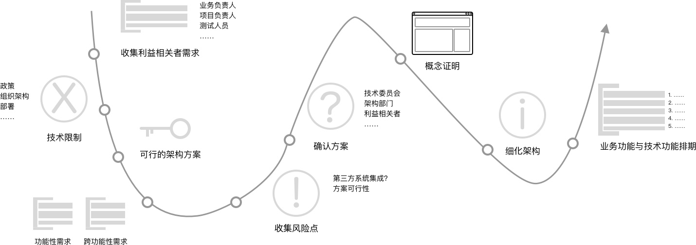

#  项目生命周期中的 Tech Lead

在大部分的组织里，一个 Tech Lead 做的事情，每个人在日常中，到底还是看得一清二楚。可是呢，项目上的每一个人，并非都是从一开始就在这个项目中的。有一些是一开始加入的，一些是早期加入的，还有的则是中途加入的。

也因此呢，我便根据 Tech Lead 要做的一些事情，再按照之前定义的[项目三步曲](https://www.phodal.com/blog/short-time-project-best-practise/)，绘制了一个在项目不同时间的 TODO Lists。

需要注意的是：这里仅列出笔者**觉得重要的部分**（PS：由于是第一个版本，所以也可能缺少一些要点）。对于某些并非那么重要的职责，可以在上述的 Tech Lead 模型中查看到。

### 技术准备期（磨合期）

在 ThoughtWorks 开启一个项目的时候，会有这么两个时期：Inception、迭代 0。它们全程都需要一个资深的程序员、架构师参与。他/她的主要职责是**设计出符合项目需要的架构**。所谓的项目需要，并不一定是最合适于这个项目的技术方案。它可能受到利益相关者、组织架构等各种因素的影响，而导致最适合的方案无法采用。如最大的领导，喜欢的是 A 方案，而不是最佳的 B 方案。

**Inception**，主要用于验证技术、业务、运营、设计、产品的可行性。过程中需要一个 Tech Lead 作为一个架构师，设计出符合项目需要的软件架构。按照我的理解，相关的过程大概如下所示：

过程中，要与项目相关的利益相关者进行沟通，与开发人员一起探讨……，最后妥协出一个能勉勉强强满足各方需求的架构。我们还会从相关的讨论中，梳理出项目相关的技术风险。

**Interation 0**。迭代 0，便是在正式开始开发人员，我们所要做的技术工作。它包含的内容有：

 - PoC 架构验证。验证系统的架构是否真正可靠，并做一些细微的调整。
 - 搭建 CI/CD
 - 编写模式示范代码。以符合系统架构风格和模式的方式，结合业务功能编写示例代码，作为其它人的参考。

除此，在技术准备期，我们还需要：

 - 对项目成员进行技术培训
 - 设计、实施测试策略
 - 部署设计及实践

这是一个相当漫长的时期。

除此，在这个时间我们还要做的一件非常重要的是：**隔离其他/她技术人员与业务人员的直接需求对话**。

对于团队的其他/她成员来说，任何的功能和需求的来源，只应该是来自于业务人员（源自业务需求），又或者是团队中的技术负责人（技术需求）。而不应该由业务人员直接与其他/她开发人员沟通。哪怕是 Tech Lead 和业务人员不在的时候，也需要减少此类事情的发生。

### 业务回补期

无论是上一个时期，还是这一个时期，我们不得不妥协于业务开发的进度，而忽视一些技术上的追求。这也就导致了，我们在技术实践上缺乏一些更好的实施。

也因此，作为一个 Tech Lead，我们需要建立一系列的规范：

 - 着手建立技术债的白板。开始一步步偿还一些技术债，诸如测试覆盖率不足的问题。
 - 创建团队的技术文化。知识分享、知识传递等。
 - 关注于团队成员的成长。

过程中，不断发布新版本的应用，也因此稳定了系统的部署架构。

### 成长优化期

到了这个阶段，作为一个 Tech Lead，我们所要关注的内容，主要有两部分：

 - 架构演进。系统已经偏向于稳定，只是我们可以探索新的方式，来帮助我们解决当前的问题。
 - 人员的培养和成长。团队的大部分成员在这个时期，已经处于 “无聊” 阶段，需要一些新的元素来帮助他/她成长。

这并不代表其他/她的几个方面是稳定的。仍然会出现一些变化，只是这些变化的影响范围并没有那么大。比如，一些关键的利益相关者更换了，那么还需要重新的摩擦一断时间。

### 其它

最后不得不提及的一点是：**受多种因素的影响**，项目的开发速率会先从落后于标准速率开始，而后追平，最后随着平均水平的提高，便超过平均速率。

所以在这个过程中，需要 Tech Lead 在合适的时期，采用合适的策略。
