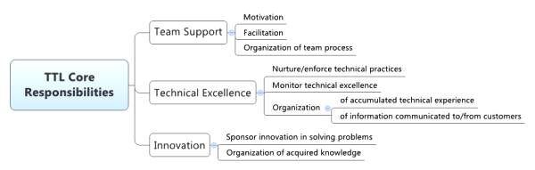

# 怎样才是好的 Tech Lead（技术负责人） ？

原文地址：[What Makes a Good Tech Lead?](https://jasonroell.com/2015/10/13/what-makes-a-good-tech-lead/)

每个团队都需要一位优秀的领导，软件团队更是如此。在面对漏洞，开发出令人敬畏的新功能以及赶上最后期限之间，团队成员需要有可以信赖的人。但他/她是谁呢？技术的团队领导职位拥有哪些技能和责任？

在我的职业生涯中，我有一些非常棒的团队领导者，也有一些不那么好。当我试图确定是什么让 “优秀” 如此惊人的工作时，这篇文章的灵感来到我身边？这些开发人员有哪些技能和责任，使他/她们与其他/她非常优秀的技术团队领导者不同？

我已经制定了一份技能和责任清单，我认为这对于技术领导者来说是必不可少的，如果他/她们要取得成功的话。他/她们应该拥有几乎所有这些技能，并且能够舒适，乐于并且能够处理所列出的责任。

## Tech Lead 核心职责地图

事实上，Tech Lead （技术负责人）平衡了几个关键职责，如下面的思维导图所示：

### 团队支持

当然，第一个也是最重要的责任是团队支持。Tech Lead （技术负责人）可以激励团队，具有促进团队活动的能力和艺术，并且可以将团队工作组织成以流程为导向的方式。人们应该想和这个人一起工作。这是让你（团队的其他成员）生活更轻松的家伙。每个人在做正确的事情时偶尔都需要得到认可，但是团队也需要得到帮助，以保持对可能变得非常困难，政治或持续时间过长的事情的激励。谢谢 Tech Lead（技术负责人）！

### 技术卓越

其次，Tech Lead （技术负责人）负责培育/执行和监控产品技术卓越性和高质量。更具体地说，Tech Lead 负责确保整个团队实现这一目标。换句话说，如果 Tech Lead 在团队无所作为的情况下自己开发了一款出色的产品，那么他在这方面仍然失败。

### 革新

第三，Tech Lead（技术负责人） 应该赞助团队工作的创新。这与卓越技术不同。它与团队精神和尝试和尝试新事物和非常规解决方案的愿望有关。这对于解决问题也是不同的，因为你可以用愚蠢的方式解决问题！

## Tech Lead 核心技能组列表

 - 能够指导各个级别资历的工作人员，从刚毕业 3 个月的人到已经编程 30 年的人
 - 如何处理与团队成员的人员问题
 - 熟悉您的开发领域。它包括：语言，框架，实用程序，开发环境
 - 对问题管理系统、项目管理技能和版本控制有充分的了解
 - 成为首选的 bug 杀手
 - 知道如何及时进行代码审查、需要做什么，以及如何最大限度地减少他们持有的时间，并进行相应的代码更改
 - 如何编写单元测试和 mock（译者注：test-double），并让开发人员也编写测试
 - 了解什么是设计模式以及何时使用它们
 - 了解代码坏味道的含义，以及如何减少代码的坏味道
 - 持续集成
 - 对项目做计划及发布的能力
 - 能够将项目组件化，并将其分解为功能部件
 - 全面了解安全性，包括正确处理密码、分离系统、保护数据等的方法。
 - 管理业务指令/目标，并将相关信息转换为开发人员的信息
 - 能够估计不同技能的程序员的花费时间
 - 能够根据技能和能力将任务分配给正确的开发人员

最后，您需要意识到您的队友不是您的开发人员。 我经常听到技术主管说 “是啊，我的开发人员......” 或 “我的家伙......”。不，无论你在团队中扮演什么角色，他们都是你的队友。担任领导角色并不意味着你是队友的老板，也不是说你可以在他们身边老板。如果有的话，它会摧毁士气，你的团队的成果将受到极大的影响。

